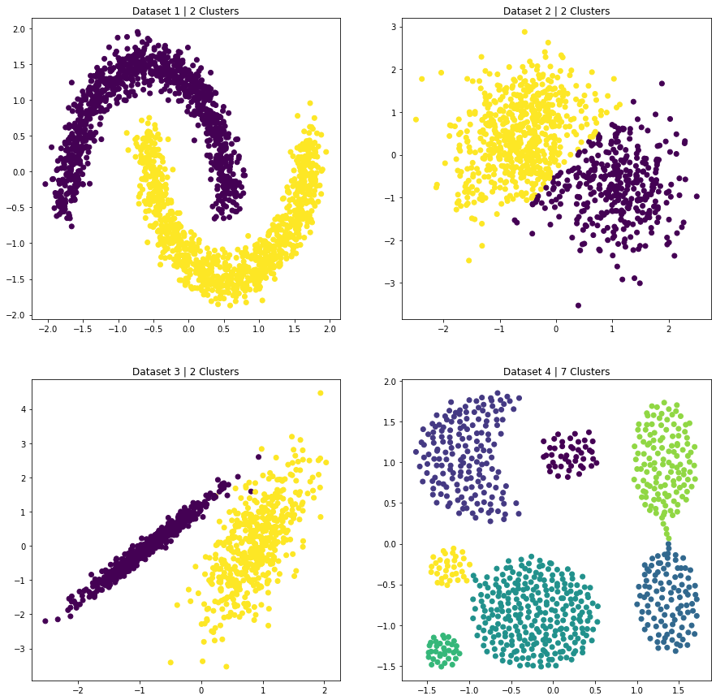
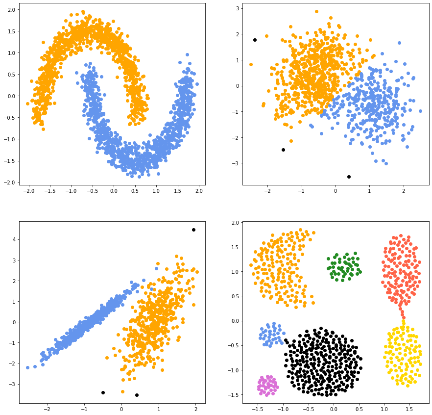
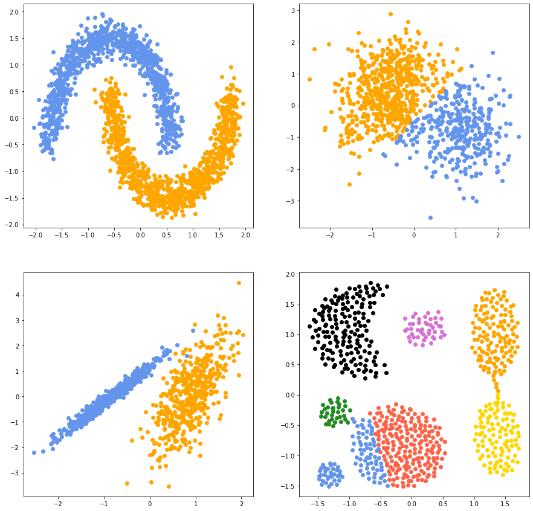
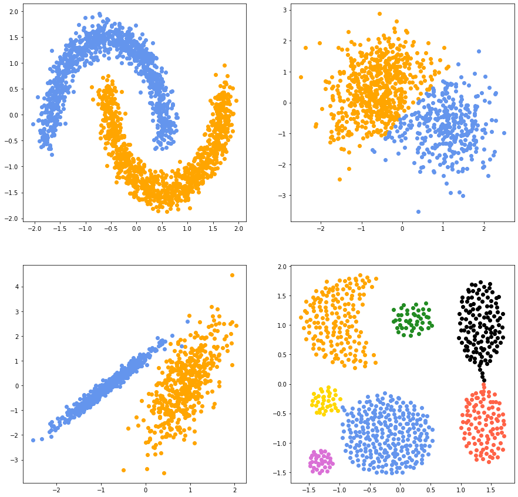
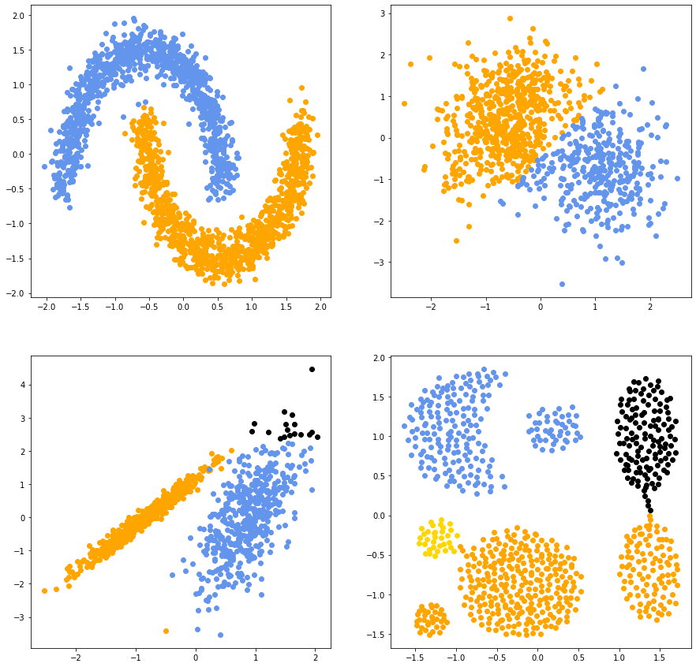

```python
import matplotlib.pyplot as plt
import numpy as np
import pandas as pd
from sklearn.preprocessing import StandardScaler
from sklearn.cluster import DBSCAN, KMeans, AgglomerativeClustering, MeanShift, estimate_bandwidth
import matplotlib.colors as mcolors
from sklearn import metrics
import warnings
warnings.filterwarnings('ignore')

np.random.seed(420)
```


```python
colors = ('orange', 'cornflowerblue', 'black', 'gold', 'tomato', 'forestgreen', 'orchid')
```

# Preprocessing


```python
df = pd.read_csv('dataset1_noClusters2.csv')
df_ = pd.DataFrame(StandardScaler().fit_transform(df))

df2 = pd.read_csv('dataset2_noClusters2.csv')
df2_ = pd.DataFrame(StandardScaler().fit_transform(df2))

df3 = pd.read_csv('dataset3_noClusters2.csv')
df3_ = pd.DataFrame(StandardScaler().fit_transform(df3))

df4 = pd.read_csv('dataset4_noClusters7.csv')
df4_ = pd.DataFrame(StandardScaler().fit_transform(df4))
```

# Plot raw data


```python
fig, axs = plt.subplots(2,2, sharex=False, sharey=False, figsize=(15,15))

axs[0, 0].set_title('Dataset 1 | 2 Clusters')
axs[0, 0].scatter(df_[0], df_[1], c=df_[2])
axs[0, 1].set_title('Dataset 2 | 2 Clusters')
axs[0, 1].scatter(df2_[0], df2_[1], c=df2_[2])
axs[1, 0].set_title('Dataset 3 | 2 Clusters')
axs[1, 0].scatter(df3_[0], df3_[1], c=df3_[2])
axs[1, 1].set_title('Dataset 4 | 7 Clusters')
axs[1, 1].scatter(df4_[0], df4_[1], c=df4_[2])

plt.show()
```


    

    


# Clustering Techniques

## DBSCAN


```python
db = DBSCAN(eps=0.3, min_samples=10).fit(df_)
db2 = DBSCAN(eps=0.8, min_samples=10).fit(df2_)
db3 = DBSCAN(eps=0.7, min_samples=10).fit(df3_)
db4 = DBSCAN(eps=0.2, min_samples=10).fit(df4_)

def prepareDBSCANPlotData(dbscanCluster, dfObject):
    labelsOfDBSCAN = set(dbscanCluster.labels_)
    n_clusters_ = len(labelsOfDBSCAN) - (1 if -1 in dbscanCluster.labels_ else 0)
    plottingData = []
    for label, color in zip(labelsOfDBSCAN, colors):    
        points = dbscanCluster.labels_ == label
        test_ = dfObject[points]
        plottingData.append([test_[0], test_[1], color, labelsOfDBSCAN])
    return plottingData

dbPlotData = prepareDBSCANPlotData(db, df_)
dbPlotData2 = prepareDBSCANPlotData(db2, df2_)
dbPlotData3 = prepareDBSCANPlotData(db3, df3_)
dbPlotData4 = prepareDBSCANPlotData(db4, df4_)
plotData = [
    [dbPlotData, dbPlotData2], [dbPlotData3, dbPlotData4]
]
fig_, axs_ = plt.subplots(2,2, figsize=(15,15))
for i in range(2):
    for j in range(2):
        plotter = plotData[i][j]
        for x in range(len(plotter[0][3])):
            #print (f"i: {i} || j: {j} || x: {x}")
            axs_[i,j].scatter(plotter[x][0], plotter[x][1], c=plotter[x][2])
```


    

    


```python
dataSets = [df_, df2_, df3_, df4_]
models = [db, db2, db3, db4]

for x in range(4):
    labels_true = dataSets[x][2]
    labels_pred = models[x].fit_predict(dataSets[x])
    dbARS = "{:.2f}".format(np.round(metrics.normalized_mutual_info_score(labels_true, labels_pred)*100,2))
    dbNMI = "{:.2f}".format(np.round(metrics.adjusted_rand_score(labels_true, labels_pred)*100,2))
    print (f"Adjusted Rand Score for DBSCAN for dataset {x+1} is: {dbARS}")
    print (f"Norm. Mutual Info   for DBSCAN for dataset {x+1} is: {dbNMI}\n")

```

    Adjusted Rand Score for DBSCAN for dataset 1 is: 100.00
    Norm. Mutual Info   for DBSCAN for dataset 1 is: 100.00
    
    Adjusted Rand Score for DBSCAN for dataset 2 is: 98.33
    Norm. Mutual Info   for DBSCAN for dataset 2 is: 99.34
    
    Adjusted Rand Score for DBSCAN for dataset 3 is: 98.69
    Norm. Mutual Info   for DBSCAN for dataset 3 is: 99.40
    
    Adjusted Rand Score for DBSCAN for dataset 4 is: 100.00
    Norm. Mutual Info   for DBSCAN for dataset 4 is: 100.00
    


# KMeans


```python
kmeans = KMeans(n_clusters=2, random_state=0).fit(df_)
kmeans2 = KMeans(n_clusters=2, random_state=0).fit(df2_)
kmeans3 = KMeans(n_clusters=2, random_state=0).fit(df3_)
kmeans4 = KMeans(n_clusters=7, random_state=5).fit(df4_)

def prepareKMeansPlotData(kmeansCluster, dfObject):
    labelsOfkmeans = set(kmeansCluster.labels_)
    n_clusters_ = len(labelsOfkmeans) - (1 if -1 in kmeansCluster.labels_ else 0)
    plottingData = []
    for label, color in zip(labelsOfkmeans, colors):    
        points = kmeansCluster.labels_ == label
        test_ = dfObject[points]
        plottingData.append([test_[0], test_[1], color, labelsOfkmeans])
    return plottingData

kmeansPlotData = prepareKMeansPlotData(kmeans, df_)
kmeansPlotData2 = prepareKMeansPlotData(kmeans2, df2_)
kmeansPlotData3 = prepareKMeansPlotData(kmeans3, df3_)
kmeansPlotData4 = prepareKMeansPlotData(kmeans4, df4_)

kmeansplotDataList = [
    [kmeansPlotData, kmeansPlotData2], [kmeansPlotData3, kmeansPlotData4]
]

figKMeans, axsKMeans = plt.subplots(2,2, figsize=(15,15))
for i in range(2):
    for j in range(2):
        plotter = kmeansplotDataList[i][j]
        for x in range(len(plotter[0][3])):
            #print (f"i: {i} || j: {j} || x: {x}")
            axsKMeans[i,j].scatter(plotter[x][0], plotter[x][1], c=plotter[x][2])
            
```


    

    


```python
dataSets = [df_, df2_, df3_, df4_]
models = [kmeans, kmeans2, kmeans3, kmeans4]

for x in range(4):
    labels_true = dataSets[x][2]
    labels_pred = models[x].fit_predict(dataSets[x])
    dbARS = "{:.2f}".format(np.round(metrics.normalized_mutual_info_score(labels_true, labels_pred)*100,2))
    dbNMI = "{:.2f}".format(np.round(metrics.adjusted_rand_score(labels_true, labels_pred)*100,2))
    print (f"Adjusted Rand Score for KMeans for dataset {x+1} is: {dbARS}")
    print (f"Norm. Mutual Info   for KMeans for dataset {x+1} is: {dbNMI}\n")

```

    Adjusted Rand Score for KMeans for dataset 1 is: 100.00
    Norm. Mutual Info   for KMeans for dataset 1 is: 100.00
    
    Adjusted Rand Score for KMeans for dataset 2 is: 100.00
    Norm. Mutual Info   for KMeans for dataset 2 is: 100.00
    
    Adjusted Rand Score for KMeans for dataset 3 is: 100.00
    Norm. Mutual Info   for KMeans for dataset 3 is: 100.00
    
    Adjusted Rand Score for KMeans for dataset 4 is: 92.20
    Norm. Mutual Info   for KMeans for dataset 4 is: 83.89
    


# Agglomerative Clustering


```python
aggClu = AgglomerativeClustering(n_clusters=2, linkage='average').fit(df_)
aggClu2 = AgglomerativeClustering(n_clusters=2, linkage='average').fit(df2_)
aggClu3 = AgglomerativeClustering(n_clusters=2, linkage='ward').fit(df3_)
aggClu4 = AgglomerativeClustering(n_clusters=7, linkage='average').fit(df4_)

def prepareAggCluPlotData(aggClu, dfObject):
    labelsOfAggClu = set(aggClu.labels_)
    n_clusters_ = len(labelsOfAggClu) - (1 if -1 in aggClu.labels_ else 0)
    plottingData = []
    for label, color in zip(labelsOfAggClu, colors):    
        points = aggClu.labels_ == label
        test_ = dfObject[points]
        plottingData.append([test_[0], test_[1], color, labelsOfAggClu])
    return plottingData

aggCluPlotData = prepareAggCluPlotData(aggClu, df_)
aggCluPlotData2 = prepareAggCluPlotData(aggClu2, df2_)
aggCluPlotData3 = prepareAggCluPlotData(aggClu3, df3_)
aggCluPlotData4 = prepareAggCluPlotData(aggClu4, df4_)

aggCluplotDataList = [
    [aggCluPlotData, aggCluPlotData2], [aggCluPlotData3, aggCluPlotData4]
]

figAggClu, axsAggClu = plt.subplots(2,2, figsize=(15,15))
for i in range(2):
    for j in range(2):
        plotter = aggCluplotDataList[i][j]
        for x in range(len(plotter[0][3])):
            #print (f"i: {i} || j: {j} || x: {x}")
            axsAggClu[i,j].scatter(plotter[x][0], plotter[x][1], c=plotter[x][2])
```


    

    


```python
dataSets = [df_, df2_, df3_, df4_]
models = [aggClu, aggClu2, aggClu3, aggClu4]

for x in range(4):
    labels_true = dataSets[x][2]
    labels_pred = models[x].fit_predict(dataSets[x])
    dbARS = "{:.2f}".format(np.round(metrics.normalized_mutual_info_score(labels_true, labels_pred)*100,2))
    dbNMI = "{:.2f}".format(np.round(metrics.adjusted_rand_score(labels_true, labels_pred)*100,2))
    print (f"Adjusted Rand Score for Agglomerative Clustering for dataset {x+1} is: {dbARS}")
    print (f"Norm. Mutual Info   for Agglomerative Clustering for dataset {x+1} is: {dbNMI}\n")
```

    Adjusted Rand Score for Agglomerative Clustering for dataset 1 is: 100.00
    Norm. Mutual Info   for Agglomerative Clustering for dataset 1 is: 100.00
    
    Adjusted Rand Score for Agglomerative Clustering for dataset 2 is: 100.00
    Norm. Mutual Info   for Agglomerative Clustering for dataset 2 is: 100.00
    
    Adjusted Rand Score for Agglomerative Clustering for dataset 3 is: 100.00
    Norm. Mutual Info   for Agglomerative Clustering for dataset 3 is: 100.00
    
    Adjusted Rand Score for Agglomerative Clustering for dataset 4 is: 100.00
    Norm. Mutual Info   for Agglomerative Clustering for dataset 4 is: 100.00
    


# Mean Shift


```python
bandwidth3 = estimate_bandwidth(df3_, quantile=0.2, n_samples=400)
bandwidth4 = estimate_bandwidth(df4_, quantile=0.2, n_samples=400)

meanShiftModel = MeanShift().fit(df_)
meanShiftModel2 = MeanShift().fit(df2_)
meanShiftModel3 = MeanShift(bandwidth=bandwidth3).fit(df3_)
meanShiftModel4 = MeanShift(bandwidth=bandwidth4).fit(df4_)

def prepareMeanShiftPlotData(meanShift, dfObject):
    labelsOfMeanShift = set(meanShift.labels_)
    n_clusters_ = len(labelsOfMeanShift) - (1 if -1 in meanShift.labels_ else 0)
    plottingData = []
    for label, color in zip(labelsOfMeanShift, colors):    
        points = meanShift.labels_ == label
        test_ = dfObject[points]
        plottingData.append([test_[0], test_[1], color, labelsOfMeanShift])
    return plottingData

meanShiftPlotData = prepareMeanShiftPlotData(meanShiftModel, df_)
meanShiftPlotData2 = prepareMeanShiftPlotData(meanShiftModel2, df2_)
meanShiftPlotData3 = prepareMeanShiftPlotData(meanShiftModel3, df3_)
meanShiftPlotData4 = prepareMeanShiftPlotData(meanShiftModel4, df4_)

meanShiftPlotDataList = [
    [meanShiftPlotData, meanShiftPlotData2], [meanShiftPlotData3, meanShiftPlotData4]
]

figMeanShift, axsMeanShift = plt.subplots(2,2, figsize=(15,15))
for i in range(2):
    for j in range(2):
        plotter = meanShiftPlotDataList[i][j]
        for x in range(len(plotter[0][3])):
            #print (f"i: {i} || j: {j} || x: {x}")
            axsMeanShift[i,j].scatter(plotter[x][0], plotter[x][1], c=plotter[x][2])
```

    1.2954372578789362


    

    


```python
dataSets = [df_, df2_, df3_, df4_]
models = [meanShiftModel, meanShiftModel2, meanShiftModel3, meanShiftModel4]

for x in range(4):
    labels_true = dataSets[x][2]
    labels_pred = models[x].fit_predict(dataSets[x])
    dbARS = "{:.2f}".format(np.round(metrics.normalized_mutual_info_score(labels_true, labels_pred)*100,2))
    dbNMI = "{:.2f}".format(np.round(metrics.adjusted_rand_score(labels_true, labels_pred)*100,2))
    print (f"Adjusted Rand Score for Mean Shift for dataset {x+1} is: {dbARS}")
    print (f"Norm. Mutual Info   for Mean Shift for dataset {x+1} is: {dbNMI}\n")
```

    Adjusted Rand Score for Mean Shift for dataset 1 is: 98.53
    Norm. Mutual Info   for Mean Shift for dataset 1 is: 99.40
    
    Adjusted Rand Score for Mean Shift for dataset 2 is: 100.00
    Norm. Mutual Info   for Mean Shift for dataset 2 is: 100.00
    
    Adjusted Rand Score for Mean Shift for dataset 3 is: 92.43
    Norm. Mutual Info   for Mean Shift for dataset 3 is: 95.91
    
    Adjusted Rand Score for Mean Shift for dataset 4 is: 79.91
    Norm. Mutual Info   for Mean Shift for dataset 4 is: 63.60
    


# Observations

Mean shift disappointed as it was barely able to identify clusters in dataset 4, while at the same time being computational complex. Agglomerative Clustering however performed immensely well, but it relies on knowing the number of clusters beforehand. DBSCAN delivered perfect results, it is a great clustering method as it was not necessary to input the number of clusters. KMeans war very easy to implement and also delivered very accurate results, however it struggled with dataset 4 and the blobs in the bottom left of it.
